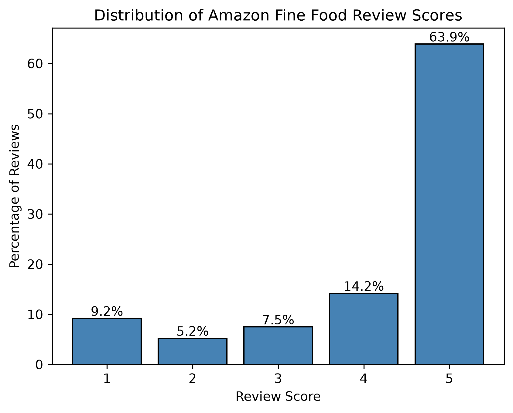
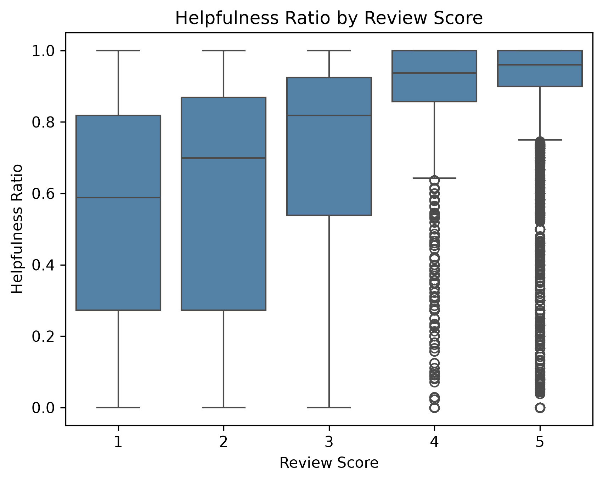
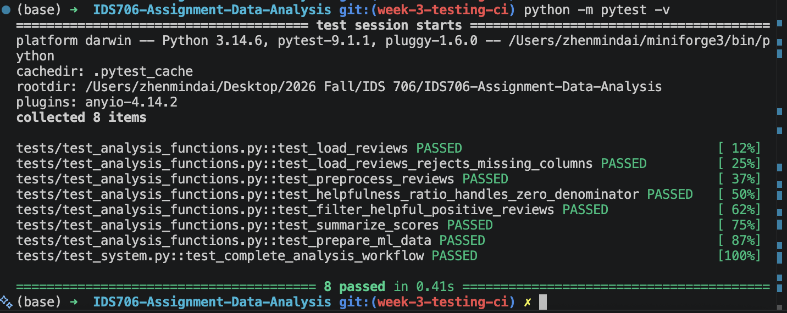
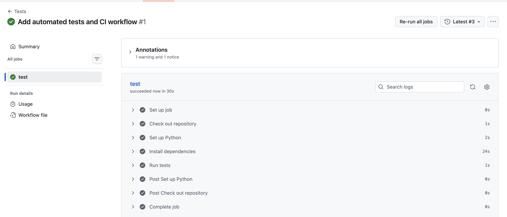

# Amazon Fine Food Reviews Data Analysis

[](https://github.com/Jacey-Dai/IDS706-Assignment-Data-Analysis/actions/workflows/tests.yml)

## Project Goal

This project uses Pandas and Polars to analyze Amazon food reviews, compare their performance on equivalent operations, visualize rating and helpfulness patterns, and explore a machine learning model for sentiment classification. A separate Rust notebook explores ownership, moving, cloning, and borrowing.

## Setup and Installation

Clone the repository and enter the project directory:

```bash
git clone git@github.com:Jacey-Dai/IDS706-Assignment-Data-Analysis.git
cd IDS706-Assignment-Data-Analysis

Install the required dependencies:

python -m pip install -r requirements.txt

Download Reviews.csv from the linked Kaggle dataset and place it at:

data/Reviews.csv

Open data_analysis.ipynb in VS Code or Jupyter, select a Python kernel, and run all cells in order.

To run the automated tests:

python -m pytest -v

## Dataset

The [Amazon Fine Food Reviews dataset](https://www.kaggle.com/datasets/snap/amazon-fine-food-reviews) contains 568,454 reviews collected from October 1999 through October 2012. It includes ratings, helpfulness votes, review summaries, and review text.

The approximately 300 MB `Reviews.csv` file is not stored in this repository. After downloading it, place it at:

```text
data/Reviews.csv
```

## Analysis

The project:

* inspected the data types, summary statistics, missing values, and duplicates;
* converted Unix timestamps into readable dates;
* filtered highly helpful positive reviews;
* grouped reviews by score;
* compared equivalent Pandas and Polars operations;
* created rating-distribution and helpfulness-ratio visualizations; and
* used TF-IDF and logistic regression to classify review sentiment.

## Key Findings

* `ProfileName` had 26 missing values and `Summary` had 27.
* No exact duplicate rows were found.
* A total of 12,550 reviews met the criteria for highly helpful positive reviews.
* Five-star reviews represented approximately 63.88% of the dataset.
* One-star reviews received the highest average number of reader votes.
* Among reviews with at least 10 votes, higher scores generally had higher median helpfulness ratios.
* Pandas and Polars produced equivalent results. In the recorded run, Polars completed the analysis approximately 2.13 times as fast as Pandas.

## Visualizations





## Machine Learning Results

Reviews with scores of 1–2 were labeled negative, while scores of 4–5 were labeled positive. Three-star reviews were excluded. A balanced sample of 40,000 reviews was divided into 32,000 training observations and 8,000 testing observations.

The TF-IDF and logistic regression model achieved **88.4% accuracy**. Precision, recall, and F1-scores were approximately 0.88–0.89 for both classes, indicating similar performance on positive and negative reviews.

## Testing

The project includes seven unit tests and one end-to-end system test.

The tests cover:

- CSV data loading and required-column validation;
- timestamp and review-text preprocessing;
- helpfulness-ratio feature engineering;
- zero-denominator and missing-column edge cases;
- positive-review filtering;
- score-level aggregation;
- machine-learning label preparation; and
- the complete workflow from CSV loading through preprocessing and analysis.

Run all tests locally from the repository root:

```bash
python -m pytest -v


### Local Test Results



### Test Results

All seven unit tests and the end-to-end system test pass locally:


The same test suite also passes automatically through GitHub Actions:



## Limitations

The performance comparison is based on one run, and the machine learning model uses a balanced sample rather than the dataset’s original class distribution.
