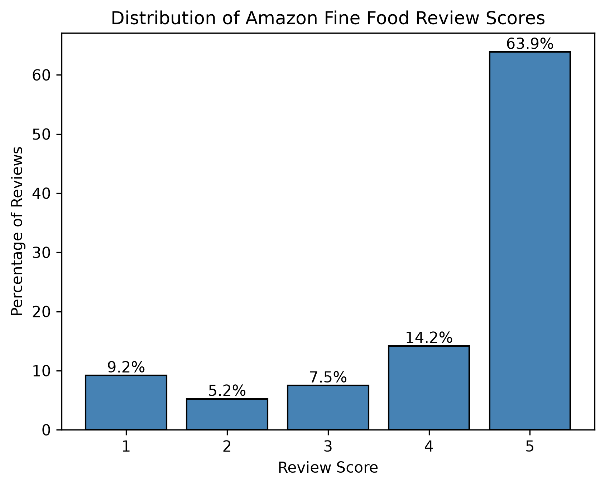
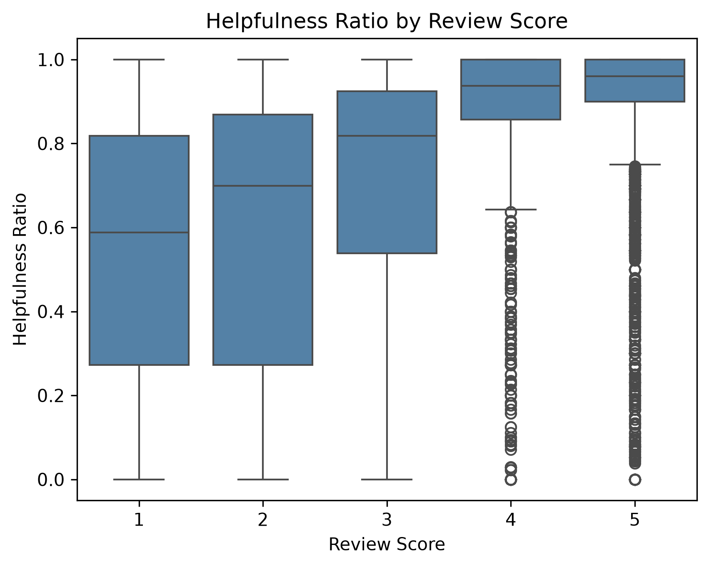
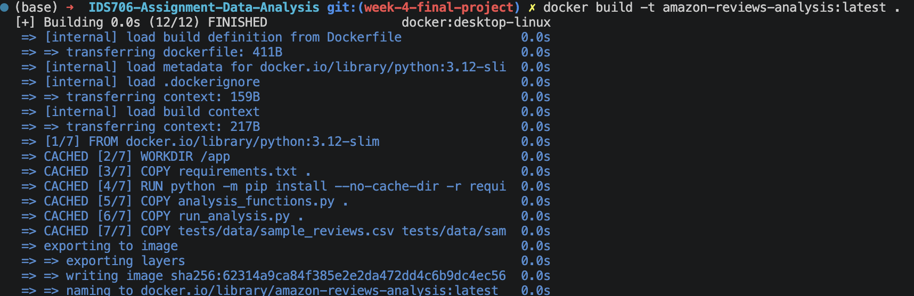
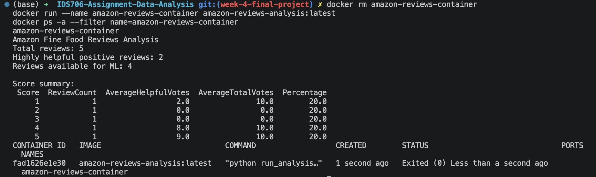
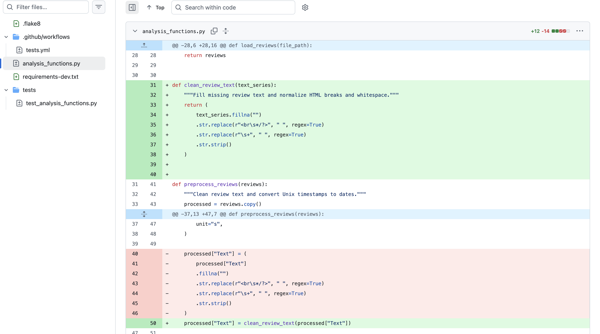
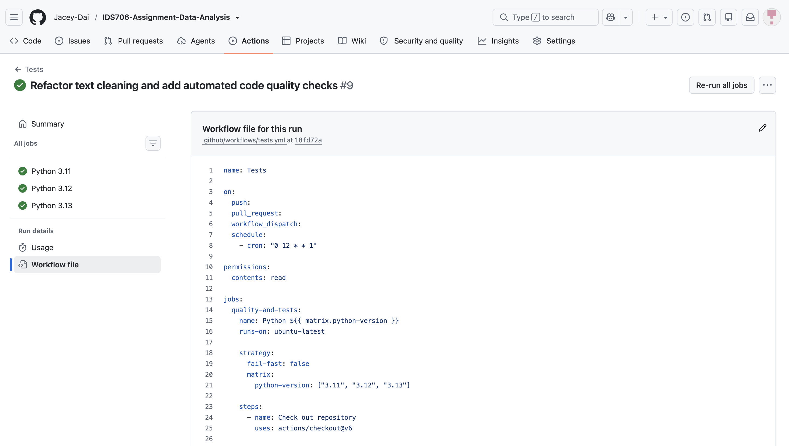

# Amazon Fine Food Reviews Data Analysis

[](https://github.com/Jacey-Dai/IDS706-Assignment-Data-Analysis/actions/workflows/tests.yml)

> **“Refactor the code, not the reviews—clean functions earn five stars.”**

## Project Goal

This project uses Pandas and Polars to analyze Amazon food reviews, compare their performance on equivalent operations, visualize rating and helpfulness patterns, and explore a machine-learning model for sentiment classification. A separate Rust notebook explores ownership, moving, cloning, and borrowing.

## Setup and Installation

Clone the repository and enter the project directory:

```bash
git clone https://github.com/Jacey-Dai/IDS706-Assignment-Data-Analysis.git
cd IDS706-Assignment-Data-Analysis
git switch week-4-final-project
```

Install the project dependencies:

```bash
python -m pip install -r requirements.txt
```

To run formatting, linting, and tests, install the development dependencies:

```bash
python -m pip install -r requirements-dev.txt
```

Download `Reviews.csv` from the linked Kaggle dataset and place it at:

```text
data/Reviews.csv
```

## Running the Analysis

Open `data_analysis.ipynb` in VS Code or Jupyter, select a Python kernel, and run all cells in order.

The reproducible command-line workflow can also be run with the included sample data:

```bash
python run_analysis.py
```

## Dataset

The [Amazon Fine Food Reviews dataset](https://www.kaggle.com/datasets/snap/amazon-fine-food-reviews) contains 568,454 reviews collected from October 1999 through October 2012. It includes ratings, helpfulness votes, review summaries, and review text.

The approximately 300 MB `Reviews.csv` file is not stored in this repository because it exceeds GitHub's standard file-size limit.

## Analysis

The project:

- inspected data types, summary statistics, missing values, and duplicates;
- converted Unix timestamps into readable dates;
- filtered highly helpful positive reviews;
- grouped reviews by score;
- compared equivalent Pandas and Polars operations;
- created rating-distribution and helpfulness-ratio visualizations;
- used TF-IDF and logistic regression to classify review sentiment; and
- added a command-line analysis entry point and reproducible Docker workflow using an included sample dataset.

## Data Quality Decisions

`ProfileName` had 26 missing values and `Summary` had 27. These rows were retained because neither field was required for the main analysis or sentiment model. The reusable text-cleaning function also handles missing review text by converting it to an empty string.

Review scores were checked against their valid 1–5 range. Helpfulness-vote counts were strongly skewed, but high values were retained because they represent genuine reader engagement rather than obvious data errors. To prevent division by zero, helpfulness ratios are treated as missing when total votes equal zero. The detailed helpfulness analysis uses reviews with at least 10 votes to reduce unstable ratios based on very small vote counts.

## Key Findings

- No exact duplicate rows were found.
- A total of 12,550 reviews met the criteria for highly helpful positive reviews.
- Five-star reviews represented approximately 63.88% of the dataset.
- One-star reviews received the highest average number of reader votes.
- Among reviews with at least 10 votes, higher scores generally had higher median helpfulness ratios.
- Pandas and Polars produced equivalent results.
- In the recorded run, Polars completed the equivalent analysis approximately 2.13 times as fast as Pandas.

## Visualizations

### Review Score Distribution



### Helpfulness Ratio by Review Score



## Machine Learning Results

Reviews with scores of 1–2 were labeled negative, while scores of 4–5 were labeled positive. Three-star reviews were excluded. A balanced sample of 40,000 reviews was divided into 32,000 training observations and 8,000 testing observations.

The TF-IDF and logistic regression model achieved **88.4% accuracy**. Precision, recall, and F1-scores were approximately 0.88–0.89 for both classes, indicating similar performance on positive and negative reviews.

## Docker

The Docker image runs the core analysis on the included sample dataset. This provides a reproducible Python environment without requiring the full 300 MB dataset.

Build and run the container:

```bash
docker build -t amazon-reviews-analysis:latest .
docker run --rm amazon-reviews-analysis:latest
```

The container performs data loading, preprocessing, filtering, grouping, and ML-data preparation before printing a concise summary. This exercise demonstrated how `.dockerignore` reduces the build context and how an exit status of `0` confirms that a batch-analysis container completed successfully.





## Refactoring and Code Quality

The original code repeated the same text-cleaning operations in preprocessing and ML-data preparation. I extracted this logic into a reusable `clean_review_text()` function. This reduced duplication, made the behavior independently testable, and ensured that both workflows apply identical cleaning rules.

A dedicated unit test verifies HTML-break removal, whitespace normalization, and missing-text handling. Black and Flake8 provide automated formatting and linting checks.

The CI workflow runs Black, Flake8, and pytest across Python 3.11, 3.12, and 3.13. It runs after pushes and pull requests, supports manual execution, and includes a weekly scheduled run.



## Testing and Continuous Integration

The project includes eight unit tests and one end-to-end system test.

The tests cover:

- CSV loading and required-column validation;
- timestamp and review-text preprocessing;
- reusable text cleaning;
- helpfulness-ratio feature engineering;
- zero-denominator and missing-column edge cases;
- positive-review filtering;
- score-level aggregation;
- machine-learning label preparation; and
- the complete workflow from CSV loading through analysis.

Run all quality checks locally:

```bash
python -m black --check analysis_functions.py run_analysis.py tests
python -m flake8 analysis_functions.py run_analysis.py tests
python -m pytest -v
```

All nine tests pass locally and through GitHub Actions.

The complete CI matrix passes on all three supported Python versions:



## Limitations

The Pandas and Polars performance comparison is based on one run and may vary across machines. The sentiment model uses a balanced sample rather than the dataset's original class distribution, and it does not evaluate neutral three-star reviews.